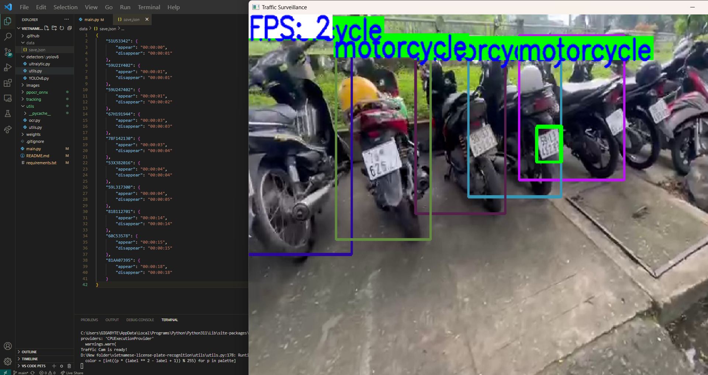

# Vietnamese license plate recognition

## Prerequisite
- 3.7 <= Python version <= 3.10

## Overview


Both vehicle detection and plate detection based on the YOLOv8 model (checkout the official repository at [Ultralytics](https://github.com/ultralytics/ultralytics)).

For tracking task, two tracking algorithms were adopt which were SORT and DeepSORT. The DeepSORT weight was taken from [John1liu](https://github.com/John1liu/YOLOV5-DeepSORT-Vehicle-Tracking-Master).

In terms of Plate Recognition, [PaddleOCR](https://github.com/PaddlePaddle/PaddleOCR) was used to recognize plate information.

## Usage
Install required libraries
```bash
pip install -r requirements.txt
```
To Inference, run this script:
```bash
python main.py --stream --read_plate --video [path_to_your_video] [optional arguments]

#example: python main.py --stream --read_plate --video "C:\\Users\\GIGABYTE\\Downloads\\vid_3.mp4"
```


**Arguments**
- ```--video```: (str) path to video
- ```--save```: (bool) save output video (the result would be saved in `data/log`, you can change save path by specify `--save_dir` augment)
- ```--save_dir```: (str) saved path
- ```--vehicle_weight```: (str) path to the yolov8 weight of vehicle detector
- ```--plate_weight```: (str) path to the yolov8 weight of plate detector
- ```--vconf```: (float) confidence for vehicle detection
- ```--pconf```: (float) confidence for plate detection
- ```--ocrconf_thres```: (float) threshold for ocr model
- ```--stream```: (bool): real-time monitoring
- ```--read_plate```: (bool): Use for plate recognition, disable it if you want to count vehicles only.

As regards streaming control, from keyboard, 
- ```Q```: exit the running window
- ```R```: to reset object tracker (equivalent to re-count number of entire vehicles from that time)
- ```P```: pause video

**Result**

